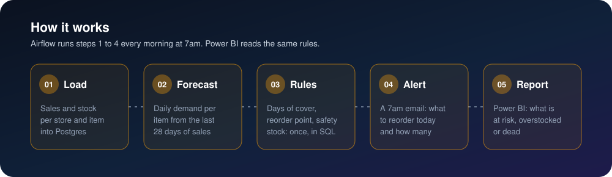
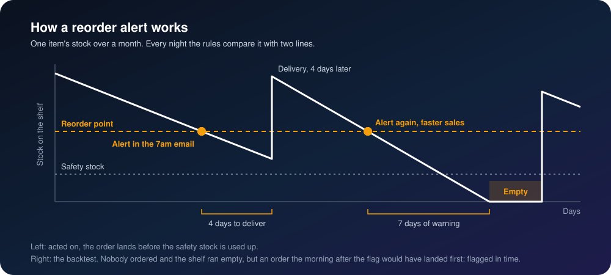
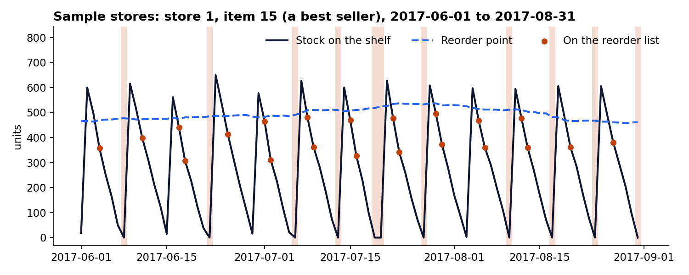
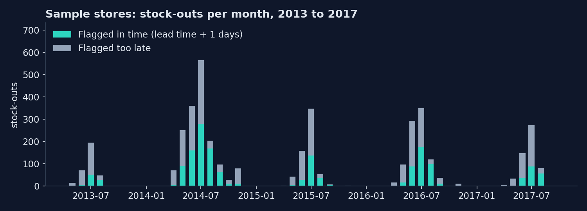
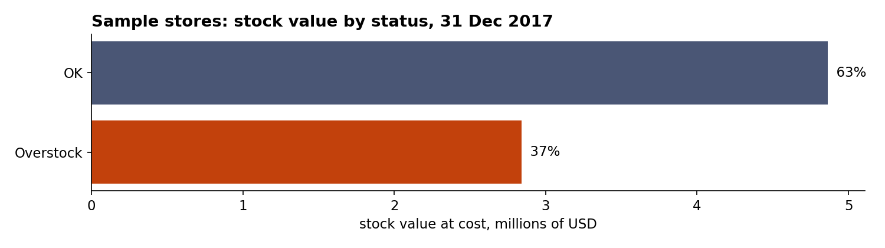
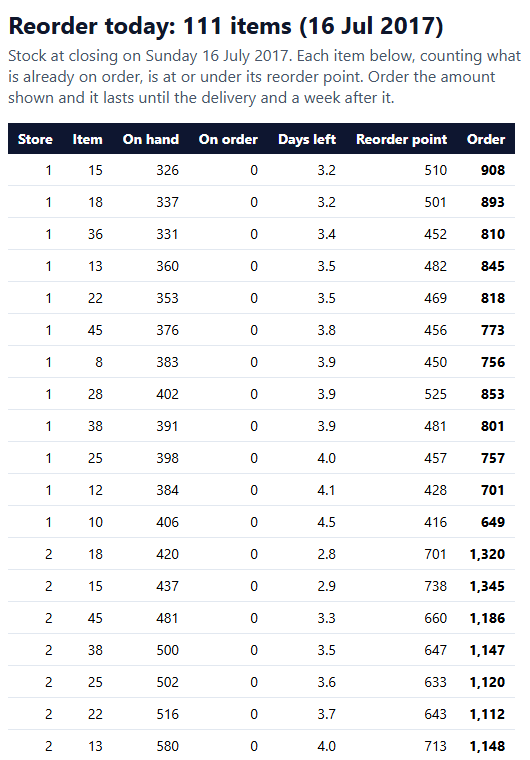

<p align="center">
  
</p>

<p align="center">
  
  
  
  
  
</p>

## The problem

Best sellers run out before anyone notices, while slow items fill the shelves. Stock is counted by
hand once a week, and every item is topped up to the same shelf level whatever it sells. The fast
items empty before the next delivery, and the slow ones sit on the shelf for weeks with cash tied
up in them.

## 🛠️ The solution

A daily pipeline loads each store's sales and stock, forecasts each item's demand, applies one set of
stock rules, emails the morning reorder list and feeds a Power BI stock report.

<p align="center">
  
</p>

### 🧠 The mental model: one shelf, two lines

<p align="center">
  
</p>

The rules are written once, in [`sql/03_rules.sql`](sql/03_rules.sql). The email, the Power BI report
and the analysis all read them from there.

| Rule | How it is worked out | In plain words |
|---|---|---|
| Daily demand | average of the last 28 days of sales | what the item sells on a normal day now |
| Safety stock | 1.65 × the daily swing × √4 | covers 95% of the ups and downs in the 4 days to delivery |
| Reorder point | daily demand × 4 + safety stock | order when the stock falls to this |
| Position | on hand + on order | counts the delivery already on its way |
| Order quantity | daily demand × 11 + safety stock − position | lasts until the delivery and a week after it |
| Days of cover | on hand ÷ daily demand | how long the shelf lasts at the current pace |
| Status | Out of stock · Dead (no sale in 28 days) · Reorder · Overstock (over 30 days of cover) · OK | one word per shelf, every day |

These are the demo's settings: the `rules` in [`config/client.yaml`](config/client.yaml) and each
item's delivery time (`lead_days`, 4 days in the demo) in the items file.

## 📈 The result

**913,000 sales rows** (10 stores × 50 items × every day of 5 years), with the rule replayed over
every day of the history:

- **4,052 stock-outs** happened under the weekly hand count. The rule had flagged every one of them
  in the 7 days before, and **1,643 (41%) early enough to order in time**. A flag is raised at
  closing, the order goes in the next morning, and the supplier delivers 4 days later, so "in time"
  needs 5 days of warning. (The first run counted 4 days as enough and got 4,047 of 4,052; that
  ignored the night between the flag and the order, so it was corrected to 5.)
- **Why not more:** 91% of the stock-outs fall on a Thursday, the day before the Friday delivery. A
  shelf that crosses the reorder point on Saturday is caught in time; one that crosses on Sunday is
  flagged one day too late. Best sellers got a median of 4 days of warning.
- **37% of stock value sat in slow stock** (more than 30 days of cover) on the last day. At the end of
  each month of 2017 it ranged from 8% in July to 42% in January.

<p align="center"></p>
<p align="center"></p>
<p align="center"></p>

Every number above is computed in [`analysis/analysis.ipynb`](analysis/analysis.ipynb) (saved with
its outputs) and checked again with SQL in [`powerbi/06-checks.md`](powerbi/06-checks.md). The
notebook writes down how each one is measured, and the one correction made after the first run.

## 📬 The morning email



Every morning at 7am, Airflow emails the reorder list: each shelf at or under its reorder point,
counting what is already on order, with how many to order. The email is always saved to `out/`, and
sent through Gmail when `.env` has an app password.

The data ends on Sunday 31 December 2017, the slow season two days after a delivery, so that
morning's list is empty. The email here is a summer Sunday's, 16 July 2017:
`python -c "import pipeline; pipeline.alert('2017-07-16')"`.

<br clear="right">

## 📊 The Power BI report

Three pages: the **reorder list** for a picked day, **stock vs reorder point** for one shelf (the
mental model above, drawn from the data), and **slow stock**. The [`powerbi/`](powerbi/) folder
builds it from nothing, by copy and paste: both queries, the model, 14 measures, 27 visuals with
their fields and positions, every interaction, the shared theme, the numbers each card must show,
and a 33-step build checklist.

_Screenshots of the finished pages go here._

## ▶️ Run it

You need Python 3.10+ and Docker Desktop.

```bash
pip install -r requirements.txt
cp .env.example .env           # then set DB_PASSWORD (and the Gmail lines for a real email)
python data/demo/make_data.py   # the demo's input files: downloads the sales, generates the stock
docker compose up -d            # the warehouse on localhost:5447, Airflow on http://127.0.0.1:8097
python pipeline.py              # load, forecast, rules, alert (or Trigger stock_reorder in Airflow)
jupyter nbconvert --to notebook --execute --inplace analysis/analysis.ipynb
```

The DAG `stock_reorder` runs every morning at 7am Cairo time. A re-run adds nothing twice: the load
skips rows already in the warehouse, and the forecast and rules are rebuilt from scratch. The load
stops the run if a stock row has no sales row or a day is missing.

| Path | What it is |
|---|---|
| `config/client.yaml`, `config.py` | every client value, read only through `load_config()` |
| `data/input/` | the three input files: sales, stock, items ([what each holds](data/input/README.md)) |
| `data/demo/make_data.py` | makes the demo's input files |
| `sql/01_tables.sql` | the warehouse tables, with keys and checks |
| `sql/02_forecast.sql`, `sql/03_rules.sql` | the forecast and the rules |
| `pipeline.py` | the four steps: load, forecast, rules, alert |
| `dags/stock_reorder.py` | the Airflow DAG, one task per step |
| `analysis/analysis.ipynb` | every number, and the charts |
| `powerbi/` | the Power BI build guide |

## 🗂️ Data

- **Sales:** the public [Store Item Demand Forecasting](https://www.kaggle.com/competitions/demand-forecasting-kernels-only)
  file (10 stores, 50 items, daily, 2013 to 2017), downloaded from a pinned GitHub copy and checked
  by its SHA-256. It is not stored in this repo.
- **Stock, deliveries, unit costs and lead times are generated** by `data/demo/make_data.py`. It replays the stores'
  current habit: every Monday each store tops every item back up to the same shelf level (three
  weeks of its average item's sales the year before), and the supplier delivers 4 days later. A
  shelf can only sell what it holds, so sales stop when it is empty.
